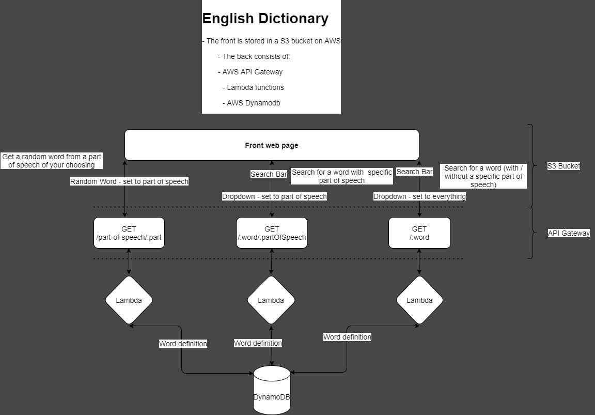

# Backend

---

This is the backend of my dictionary website.

There are several different options here:

- AWS Lambda functions
- Express REST API

In My website I used the AWS Lambda functions

---

## Lambda Functions

- `getWord`: URL:`https://d9ksdduklc.execute-api.eu-central-1.amazonaws.com/dictionary/:word` Gets the definitions and part of speech of a provided word

- `getWordAndPart`: URL:`https://d9ksdduklc.execute-api.eu-central-1.amazonaws.com/dictionary/:word/:pos` Gets the definitions of a word from provided word and part of speech

- `randomWordFromPart`: URL:`https://d9ksdduklc.execute-api.eu-central-1.amazonaws.com/dictionary/part-of-speech/:pos` Gets the definitions of a random word from provided part of speech

## Structure

